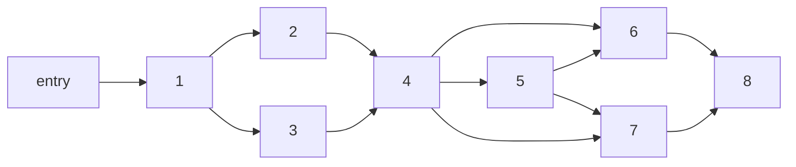
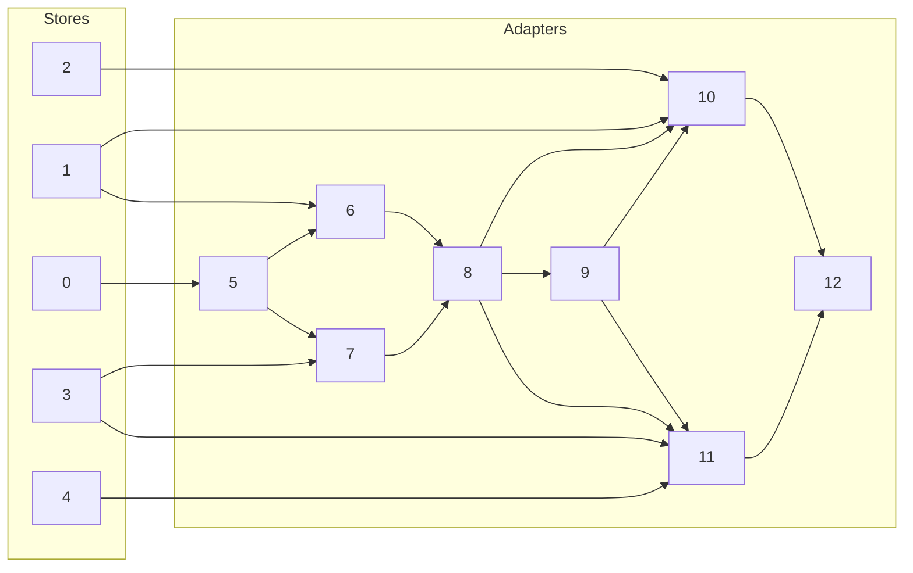

### Simple example:

```mermaid
graph LR
  entry --> 1;
  1 --> 2;
  1 --> 3;
  2 --> 4;
  3 --> 4;
  4 --> 5;
  4 --> 6;
  5 --> 7;
  4 --> 7;
  5 --> 6;
  6 --> 8;
  7 --> 8;
```

### Complicate example:

```mermaid
graph LR
    0 --> 5;
    2 --> 10;
    1 --> 10;
    1 --> 6;
    5 --> 6;
    5 --> 7;
    3 --> 7;
    6 --> 8;
    7 --> 8;
    8 --> 9;
    8 --> 10;
    9 --> 11;
    8 --> 11;
    3 --> 11;
    4 --> 11;
    9 --> 10;
    10 --> 12;
    11 --> 12;

    subgraph Stores
        2;
        1;
        0;
        3;
        4;
    end

    subgraph Adapters
        10;
        6;
        5;
        7;
        8;
        9;
        11;
        12;
    end

```
